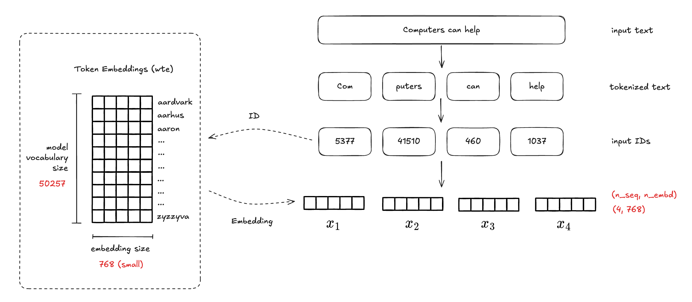
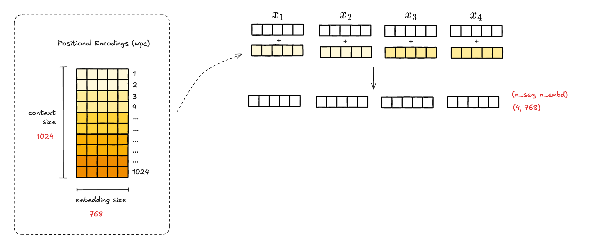
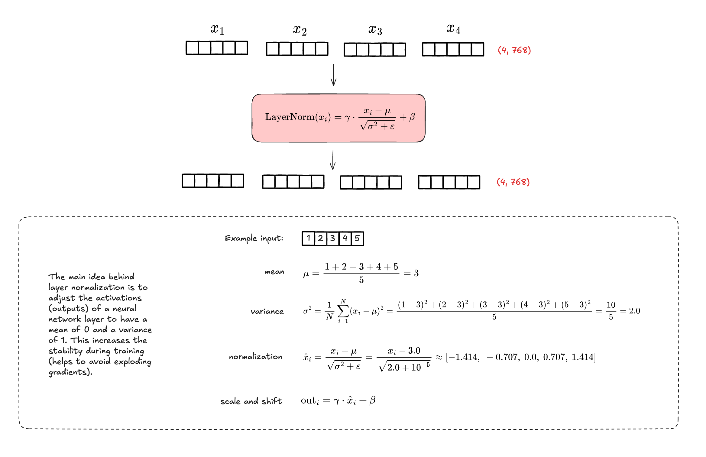
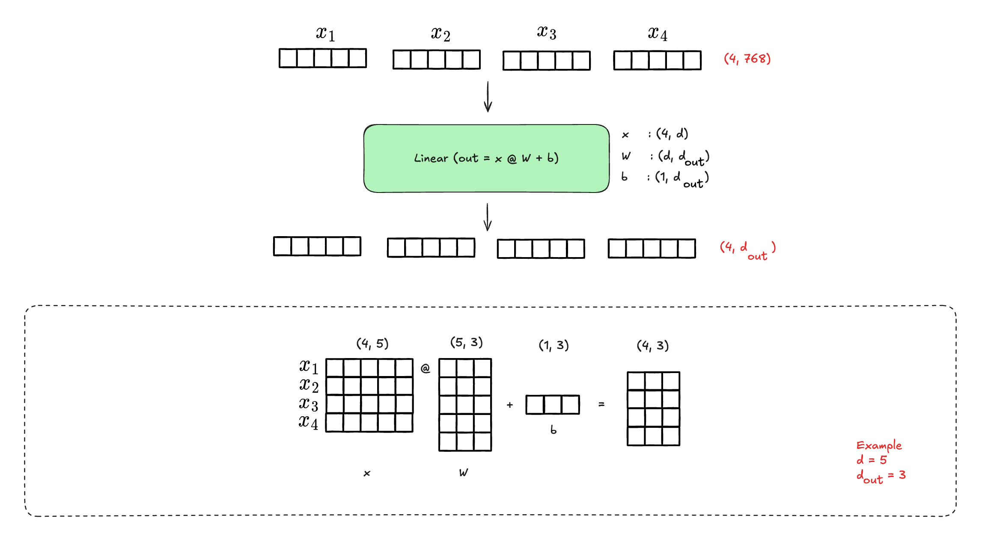
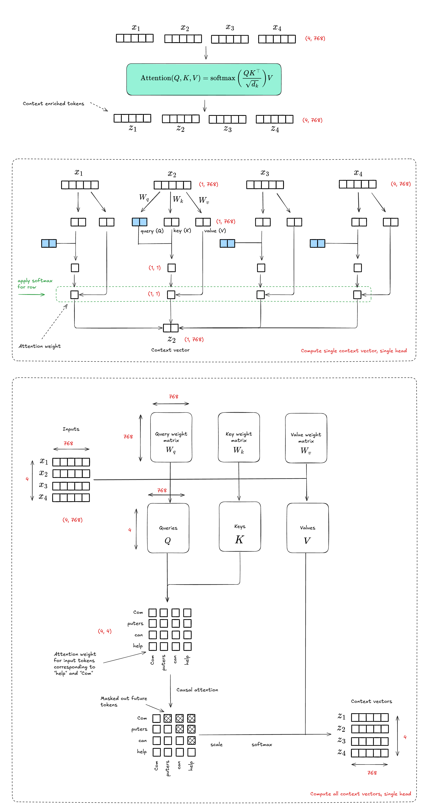
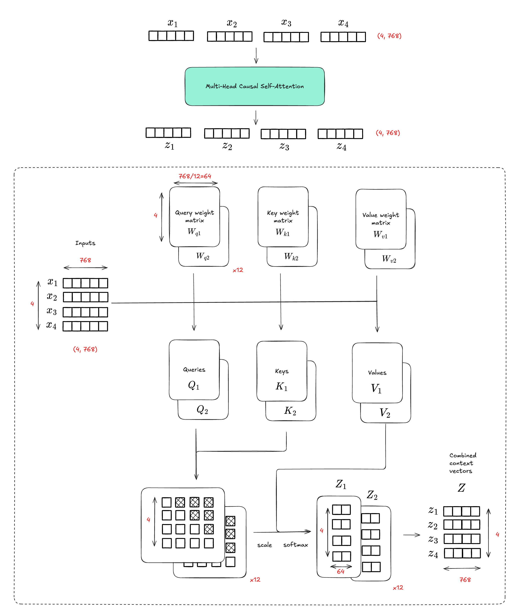
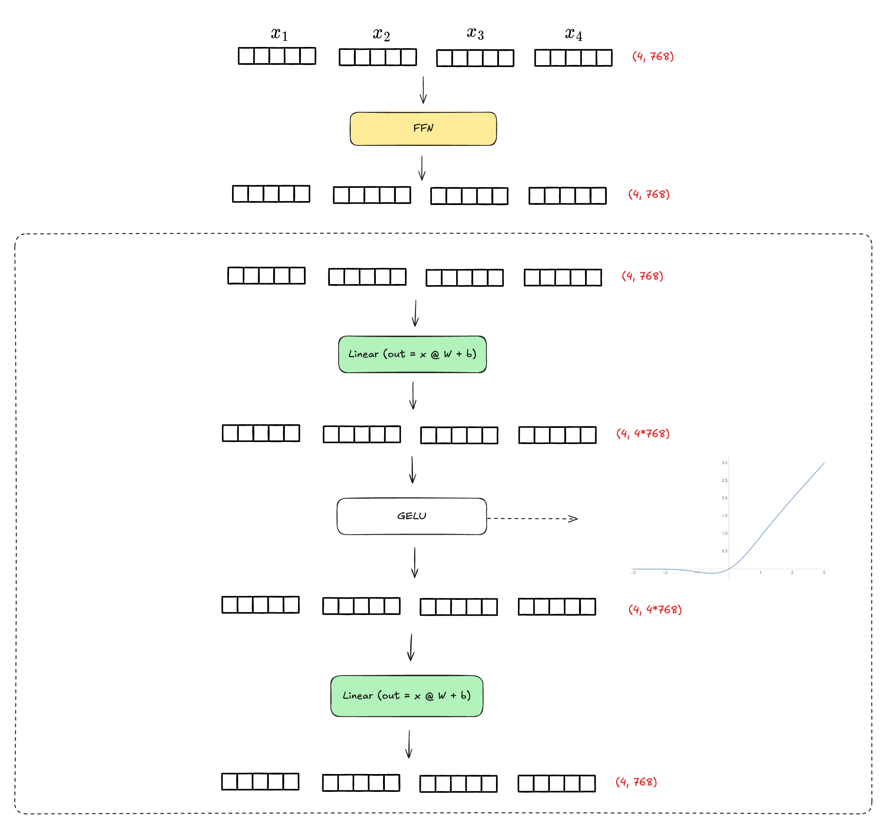
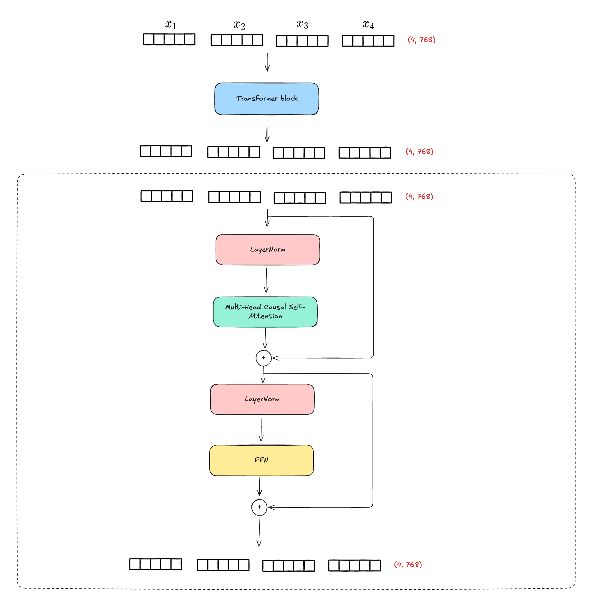
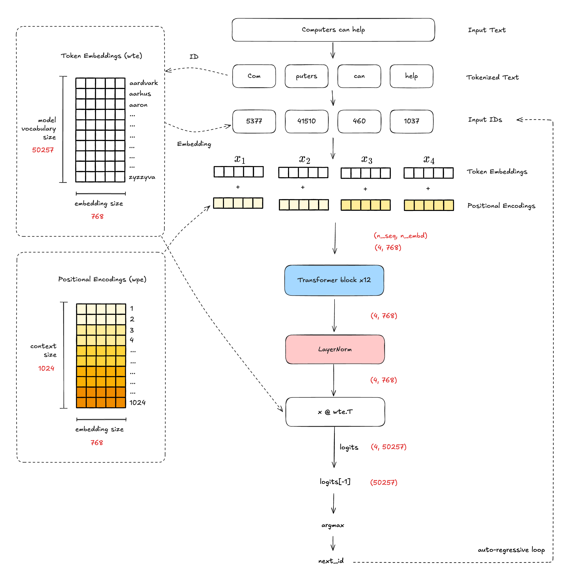

<div align='center'>


<strong>GPT-2 inference in plain NumPy. No PyTorch, no CUDA — just matrix multiplies.</strong>

[](LICENSE)
[](https://www.python.org/downloads/)

</div>

## Setup

```bash
uv sync
uv run python -m src.gpt2 --prompt "Computers can help"
```

Model weights are downloaded automatically from HuggingFace on first run into `models/<model_size>/`.

**Flags**

| Flag | Default | Options |
|------|---------|---------|
| `--prompt` | required | any string |
| `--n_tokens_to_generate` | `40` | integer |
| `--model_size` | `124M` | `124M`, `355M`, `774M`, `1558M` |
| `--models_dir` | `models` | path |

## Architecture

The forward pass is implemented as standalone NumPy functions in `src/gpt2.py`. Below is a walkthrough of the full computation graph.

### 1. Token Embeddings



The model has no concept of text — it only operates on numbers. The BPE tokenizer splits the input string (e.g. `"Computers can help"`) into subword tokens (`"Com"`, `"puters"`, `"can"`, `"help"`) and maps each to an integer ID (`[5377, 41510, 460, 1037]`). These IDs are then used as row indices into `wte`, a learned lookup table of shape `[50257 × 768]` — one 768-dimensional vector per vocabulary entry. The result is a matrix `[n_seq × 768]` where each row is a dense, continuous representation of the corresponding token. These vectors are not hand-crafted: they are parameters learned during training, and similar tokens end up with similar vectors.

### 2. Positional Encodings



Transformers process all tokens simultaneously rather than one at a time, so the model has no inherent sense of order. To fix this, a second lookup table `wpe [1024 × 768]` stores one learned vector per position (up to the maximum context length of 1024). Position indices `[0, 1, 2, 3, ...]` are used to retrieve the corresponding rows, producing a `[n_seq × 768]` matrix of positional embeddings. These are added elementwise to the token embeddings, giving each position a distinct signature. Without this step, swapping word order would produce identical activations throughout the network.

### 3. Primitives: Layer Norm & Linear

 

These two operations are the basic building blocks used repeatedly throughout the network. **Layer norm** standardizes each token's 768-dimensional activation vector to have mean 0 and variance 1 — computed across the embedding dimension for that token independently. It then applies learned scale (γ) and shift (β) parameters, giving the model control over the output range. This keeps activations in a stable range as they flow through many layers. **Linear** is a plain matrix multiply with bias: `x @ W + b`. Given input `[n_seq × d_in]` and weight matrix `[d_in × d_out]`, it projects every token's representation into a new space of dimension `d_out` — the same transformation applied to each token position independently.

### 4. Single-Head Attention



Attention is the mechanism by which tokens gather information from other tokens. Given input `[n_seq × 64]` (already split to one head), three separate linear projections produce Queries (Q), Keys (K), and Values (V). The dot product `Q @ K.T` scores how relevant each key position is to each query position, scaled by `√64` to prevent the dot products from growing too large for softmax. A causal mask then sets all upper-triangle entries to −∞, forcing each token to attend only to itself and tokens that came before it — this is what makes the model "autoregressive" and unable to cheat by looking ahead. After softmax, each row of the resulting `[n_seq × n_seq]` weight matrix sums to 1 and represents a distribution over past positions. Multiplying by V produces context-enriched representations: `[n_seq × 64]`.

### 5. Multi-Head Attention



Rather than running a single attention operation over the full 768 dimensions, MHA splits the problem across 12 parallel heads of 64 dims each (`12 × 64 = 768`). A single linear projection `c_attn` maps `x [n_seq × 768]` to `[n_seq × 2304]`, which is then split into Q, K, V each of shape `[n_seq × 768]`. Each of those is further split into 12 slices of 64 dims, giving 12 independent (Q, K, V) triples. Attention (from step 4) runs on each head in parallel, and the 12 outputs `[n_seq × 64]` are concatenated back to `[n_seq × 768]` and passed through a final linear projection `c_proj`. The multi-head design lets different heads specialize — one might track syntactic agreement, another coreference — rather than forcing a single attention pattern over the full space.

### 6. Feed-Forward Network



After attention gathers information across positions, the FFN processes each token's updated representation independently. It applies two linear projections with a GELU non-linearity in between: first expanding `768 → 3072` (`c_fc`), then contracting `3072 → 768` (`c_proj`). The 4× expansion gives the network a larger intermediate space to represent complex functions before compressing back. GELU is a smooth approximation to ReLU that allows small negative values to pass — unlike ReLU's hard zero cutoff. Critically, FFN has no cross-token communication: it is applied row-by-row, making it the complement of attention (which communicates across positions but applies a fixed linear mix).

### 7. Transformer Block



A transformer block stacks MHA and FFN into a single repeatable unit using two design choices that make deep networks trainable. **Pre-norm**: LayerNorm is applied to `x` before each sublayer (not after), which stabilizes the gradient signal entering each operation. **Residual connections**: the output of each sublayer is added back to the original input (`x = x + sublayer(LayerNorm(x))`), creating a direct path for gradients to flow all the way back to the embedding layer without passing through 12 layers of matrix multiplies. The shape `[n_seq × 768]` is preserved throughout — input and output are identical in shape, which is what makes stacking 12 identical blocks possible.

### 8. Full GPT-2



The full model connects all the pieces into an autoregressive generation loop. The input string is BPE-tokenized to IDs, which are used to look up token embeddings from `wte` and positional embeddings from `wpe`; these are summed to produce `x [n_seq × 768]`. The sequence then passes through 12 transformer blocks unchanged in shape, followed by a final layer norm `ln_f`. To produce logits over the vocabulary, `x` is projected via `x @ wte.T` — reusing the token embedding matrix transposed (`[768 × 50257]`), a technique called **weight tying** that reduces parameter count and keeps the embedding and output spaces aligned. `logits[-1]` extracts the predictions for the last position, and `argmax` picks the highest-scoring token. That token ID is appended to the input and the whole forward pass runs again — this is the autoregressive loop, generating one token at a time.

## Notebooks

| Notebook | Description |
|----------|-------------|
| `notebooks/1.0_forward_pass.ipynb` | Traces a single forward pass with real values at each stage |
| `notebooks/2.0_explainability.ipynb` | Attention visualization and token attribution |
| `notebooks/3.0_exercises.ipynb` | Lab: trace a token through the network — five connected exercises building from tokenization to a full manual forward pass |

## Development

```bash
uv run ruff format      # format
uv run pytest           # tests
uv run pyrefly check    # type check
```

## References

- [picoGPT](https://github.com/jaymody/picoGPT)
