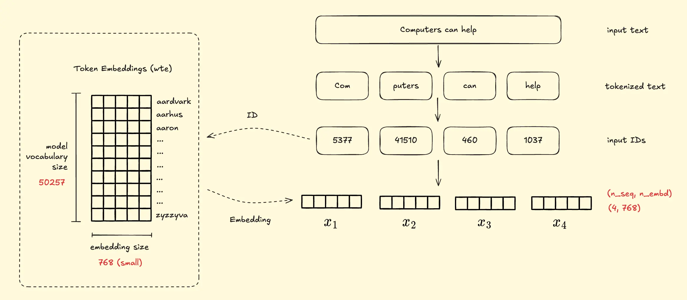
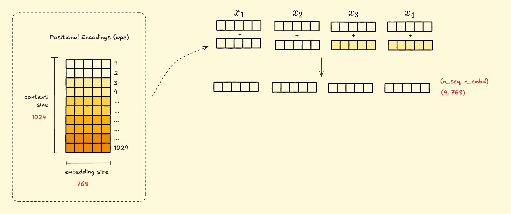
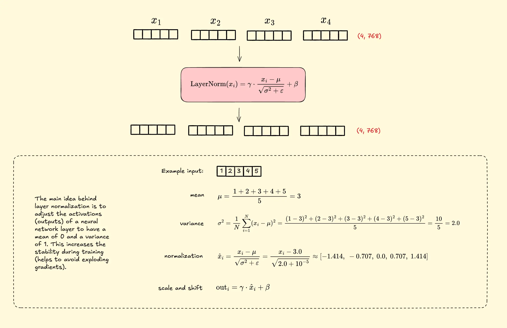
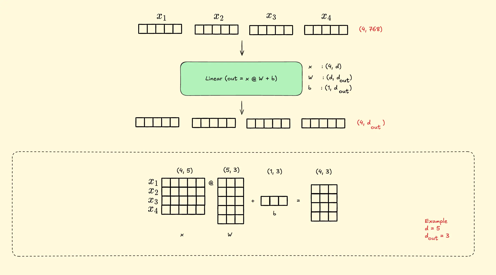
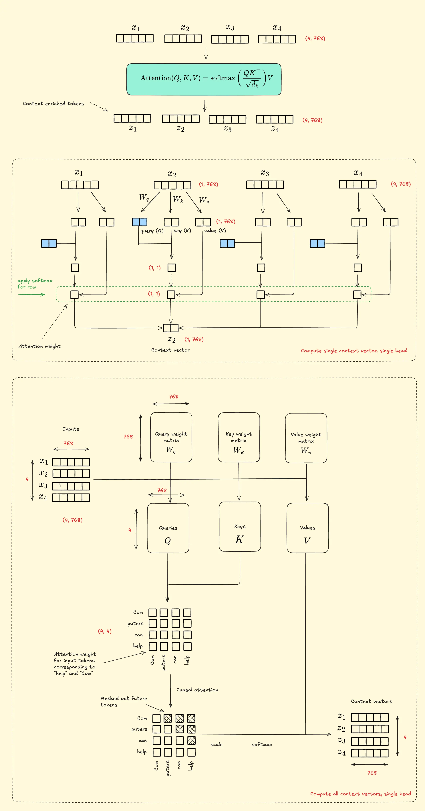
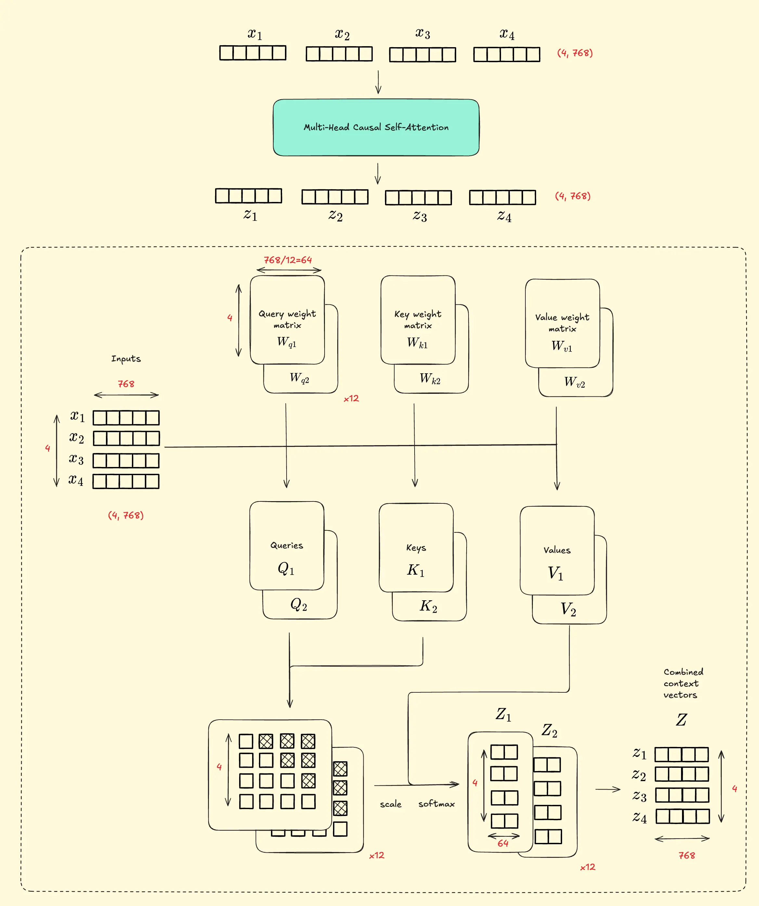
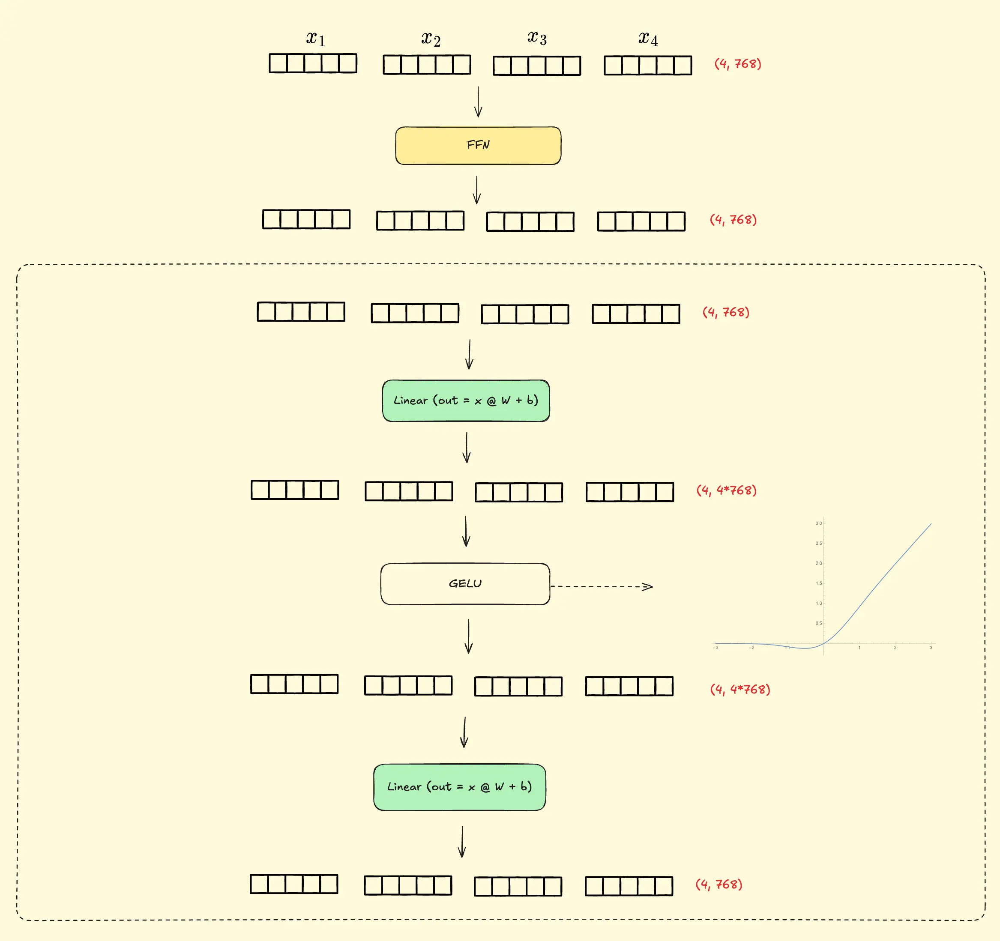
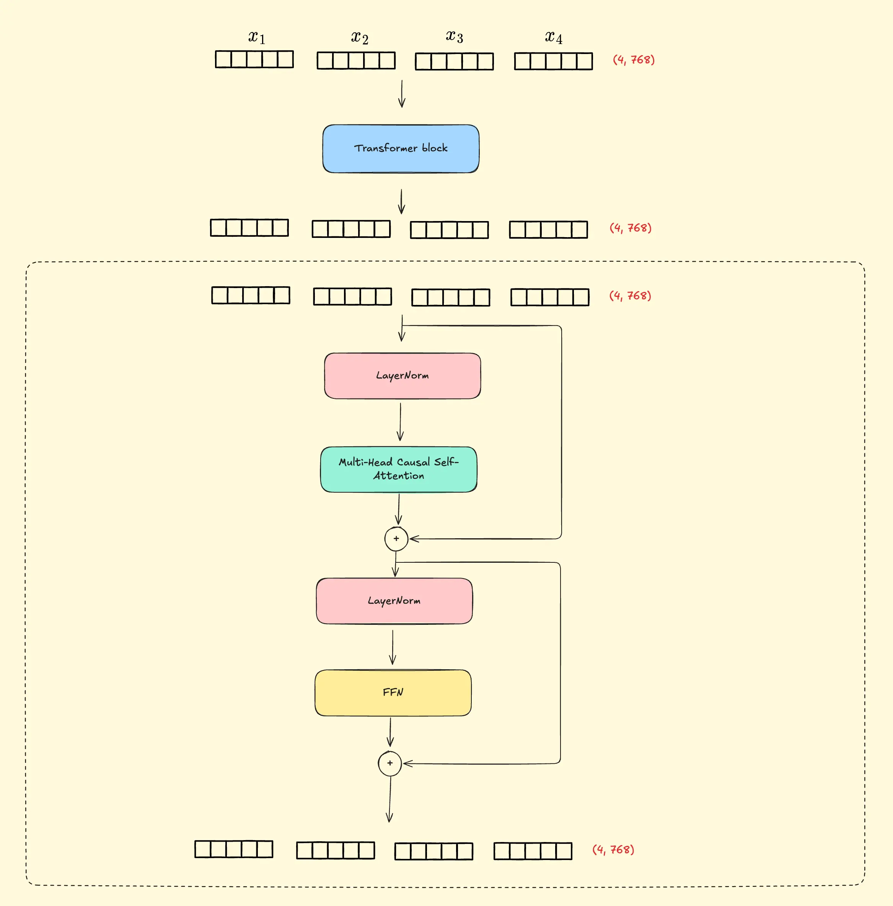
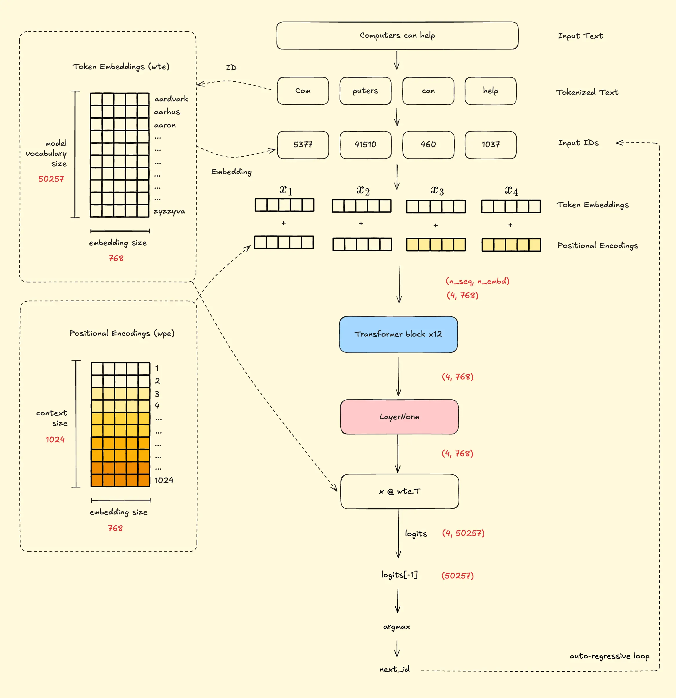

# NumpyGPT

GPT-2 inference in plain NumPy. No PyTorch, no CUDA — just matrix multiplies. Weights are loaded from Hugging Face in `safetensors` format.

## Setup

```bash
uv sync
uv run python -m src.gpt2 --prompt "Computers can help"
```

Model weights are downloaded automatically from Hugging Face on first run into `models/<model_size>/`.

**Flags**

| Flag | Default | Options |
|------|---------|---------|
| `--prompt` | required | any string |
| `--n_tokens_to_generate` | `40` | integer |
| `--model_size` | `124M` | `124M`, `355M`, `774M`, `1558M` |
| `--models_dir` | `models` | path |

## Architecture

The forward pass is implemented as standalone NumPy functions in `src/gpt2.py`. Below is a walkthrough of the full computation graph.

### 1. Token Embeddings



Token IDs index into the `wte` weight table `[50257 × 768]`, converting discrete integers into dense 768-dim vectors.

### 2. Positional Encodings



Position indices `[0..n_seq]` index into `wpe [1024 × 768]`. The result is added elementwise to token embeddings — without this, the model cannot distinguish word order.

### 3. Primitives: Layer Norm & Linear

 

Two building blocks used throughout the network. Layer norm standardizes each token's activations to mean=0, std=1 then rescales with learned γ, β. Linear is a plain matrix multiply with bias.

### 4. Single-Head Attention



Projects input into Q, K, V; computes scaled dot-product scores `Q@K.T/√d_k`; applies a causal mask (future tokens → −∞); softmax to get weights; weighted sum of V.

### 5. Multi-Head Attention



A single `c_attn` projection produces Q, K, V `[n_seq × 768]` each. These are split into 12 heads of 64 dims, attention runs in parallel per head, outputs are concatenated back to `[n_seq × 768]`.

### 6. Feed-Forward Network



Two-layer MLP applied independently per token: expand `768→3072` with GELU activation, contract `3072→768`. Unlike attention, FFN has no communication between positions.

### 7. Transformer Block



Combines MHA and FFN with pre-norm and residual connections:
```
x = x + MHA(LayerNorm(x))
x = x + FFN(LayerNorm(x))
```

Residual connections let gradients flow directly to earlier layers, enabling training at depth.

### 8. Full GPT-2



End-to-end: BPE tokenize → token+position embeddings → 12× transformer block → final layer norm → `x@wte.T` → argmax → append token → repeat. Note `wte` is reused as the output projection (weight tying).

## Notebooks

| Notebook | Description |
|----------|-------------|
| `notebooks/1.0_forward_pass.ipynb` | Traces a single forward pass with real values at each stage |
| `notebooks/2.0_explainability.ipynb` | Attention visualization and token attribution |
| `notebooks/3.0_exercises.ipynb` | Exercises |

## Development

```bash
uv run ruff format      # format
uv run pytest           # tests
uv run pyrefly check    # type check
```

## References

- [picoGPT](https://github.com/jaymody/picoGPT)
